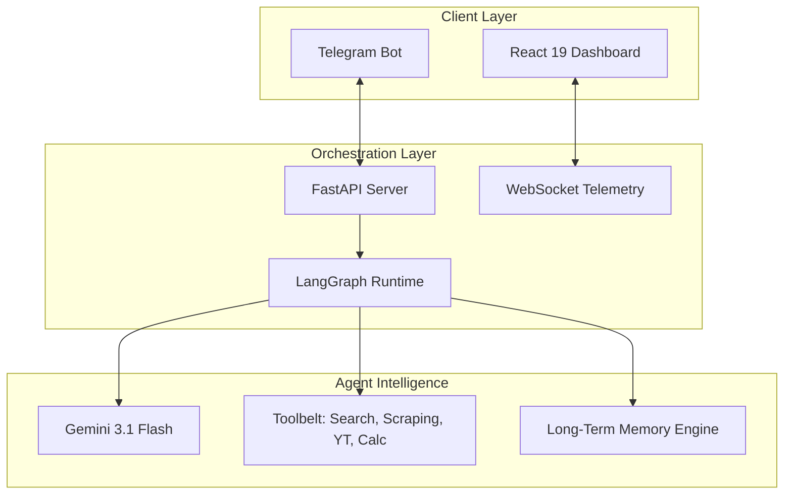

# 🚀 AgentFlow | AI Agent Orchestration Platform

AgentFlow is a professional-grade, autonomous multi-agent orchestration platform. It empowers teams to build, monitor, and deploy specialized AI agents equipped with real-world tools. Engineered for high-performance reasoning and real-time telemetry, AgentFlow bridges the gap between complex LLM workflows and production-ready interfaces.

---

## 🏛️ System Architecture

AgentFlow utilizes a **decoupled, event-driven architecture** to ensure scalability and separation of concerns.

### 🎯 Key Engineering Decisions
- **Orchestration: LangGraph**: We use a State-Machine approach to allow for cycles, conditional routing, and persistent `AgentState`.
- **LLM: Google Gemini**: Selected for its **1M+ token context window** and native multimodal capabilities (text + image).
- **Static Asset Serving**: To optimize performance, generated images are stored locally and served via a lightweight Markdown pointer, reducing WebSocket payload size.
- **Async-First**: The entire backend is built on `FastAPI` with `async/await` to handle concurrent LLM and Tool I/O without blocking.

---

## 📂 Project Structure Map

| Directory | Purpose |
| :--- | :--- |
| `agentflow-platform/backend/` | Core FastAPI logic, API routers, and database models. |
| `agentflow-platform/backend/runtime/` | **The Brain.** Contains LangGraph logic, tool definitions, and LLM wrappers. |
| `agentflow-platform/frontend/` | React 19 source code, dashboard layouts, and ReactFlow canvas logic. |
| `agentflow-platform/docs/` | Deep-dive documentation for each phase of development. |
| `start_platform.py` | Single-command entry point to launch the entire ecosystem. |

---

## 🛠️ Team Collaboration Guide

### 1. Adding a New Tool
To equip agents with new capabilities:
1.  Open `agentflow-platform/backend/runtime/tools.py`.
2.  Define your tool using the `@tool` decorator.
3.  Add the function name to the `AVAILABLE_TOOLS` dictionary.
4.  The tool will automatically be selectable in the Dashboard UI.

### 2. Modifying Workflow Logic
Workflow routing is handled in `agentflow-platform/backend/runtime/graph_builder.py`. You can adjust how agents hand off tasks or introduce new conditional nodes here.

---

## 🔐 Security & Setup

### Local Installation
1.  **Environment**: Copy `.env.example` to `.env`.
2.  **Keys**: Add your `GEMINI_API_KEY` and `TELEGRAM_BOT_TOKEN`.
3.  **Launch**: Run `python start_platform.py`.

---

## 📚 Technical Documentation
For deep-dives into specific modules, refer to our internal technical docs:
- [🚀 Architecture Deep Dive](./Architecture_DeepDive.md)
- [🏗️ Backend Foundation](./agentflow-platform/docs/1_backend_foundation.md)
- [🧠 Agent Runtime](./agentflow-platform/docs/2_core_agent_runtime.md)
- [📊 Workflow Builder](./agentflow-platform/docs/4_workflow_builder_and_monitoring.md)

---

## 📱 External Integration
The Telegram bot acts as a mobile extension of the platform. It uses the same workflow engine, ensuring that logic updated on the web dashboard is immediately available on mobile.

2. Define the nodes (agents) and edges (logic paths).
3. Run the script to inject the template into the `agentflow_platform.db`.
